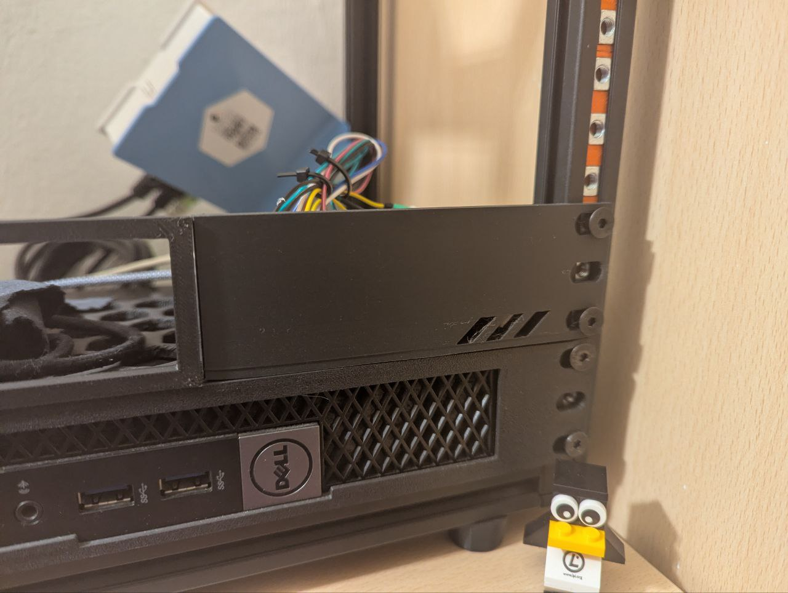

# Air Quality & Presence Station (ESPHome)



A standalone, multi-sensor station built on the **ESP8266 NodeMCU V2**. It monitors indoor air quality (PM2.5, CO2, TVOC), temperature, humidity, and detects human presence using mmWave radar.

The device runs a local **Web Server** (accessible via browser) and integrates seamlessly with **Home Assistant**.
---

## 🛠️ Hardware Required

| Component | Quantity | Voltage | Notes |
| --- | --- | --- | --- |
| **NodeMCU V2 (ESP-12E)** | 1 | 5V (USB) | Main Controller |
| **PM1006** | 1 | **5V** | LED Particle Sensor |
| **AHT21 + ENS160** | 1 | **3.3V** | Combo Module (I2C) |
| **HLK-LD2410C** | 1 | **5V** | mmWave Radar |

---

🖨️ 3D Enclosure / Case

A custom 3D printed case has been designed for this project to fit the NodeMCU and sensors ("Minirack" style). You can view, measure, and download the STL/STEP files directly from Onshape.

[View 3D designs](https://cad.onshape.com/documents/e66a7972bee8e0914a29a0f6/w/74442f743c7efd9fbcd983ab/e/899fb40ebec1d5741c28e923)

---


## ⚙️ Pre-Installation (Crucial!)

Before assembling, you must change the baud rate of the **LD2410 Radar**:

1. Power the LD2410 (5V & GND).
2. Download the **HLKRadarTool** app on your smartphone.
3. Connect to the sensor via Bluetooth.
4. Change Baud Rate from `256000` to **`38400`**.
5. Save and Restart the sensor.

*If you do not do this, the radar will not work with this configuration.*

---

## 📥 Installation

### 1. Secrets File

Create a file named `secrets.yaml` in your ESPHome config folder:

```yaml
wifi_ssid: "YOUR_WIFI_NAME"
wifi_password: "YOUR_WIFI_PASSWORD"
```

### 2. Flash Firmware

1. Connect the NodeMCU to your PC via USB.
2. Run `esphome run air-station.yaml`.
3. Once flashed, the device will connect to WiFi.
4. **Note:** You can leave the USB connected to view logs; the UART conflicts are resolved in this configuration.

---

## 📊 How to Use

### Web Interface (Standalone)

1. Find the device IP address (check your router or the USB logs).
2. Open a browser and type: `http://<DEVICE_IP>`.
3. You will see real-time values for all sensors.


---

## 📝 License

This project is open source. Use it, modify it, breathe clean air!